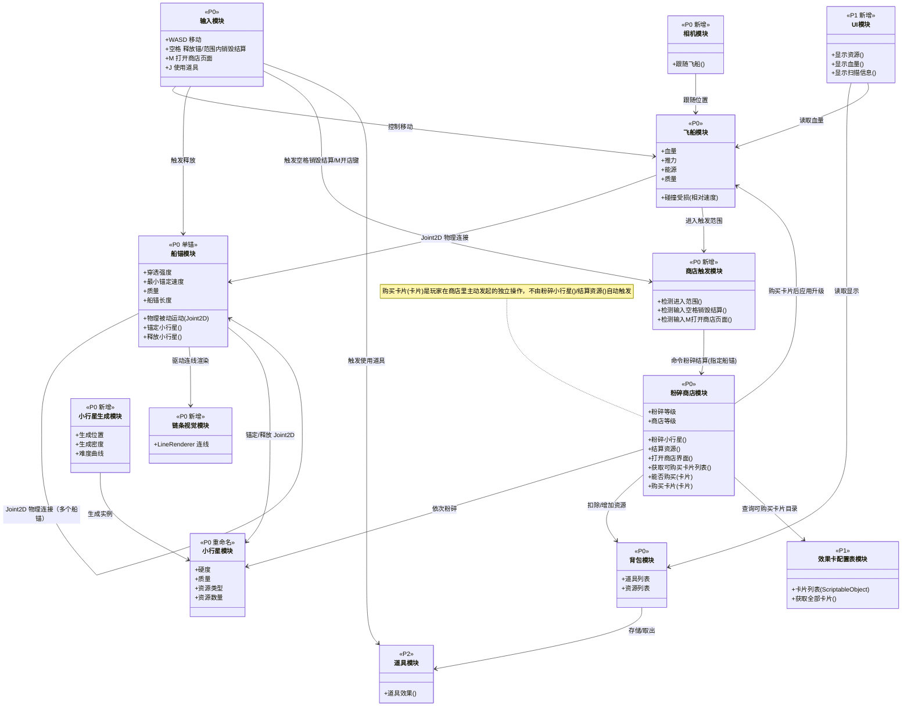
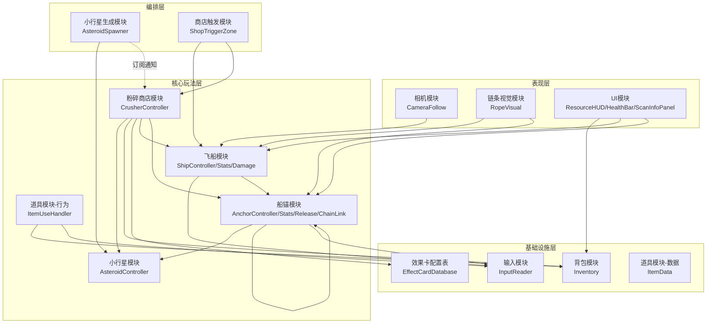
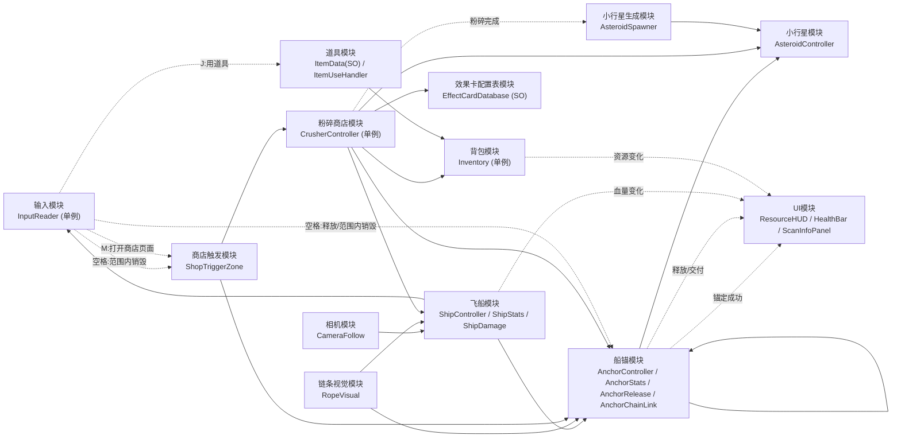
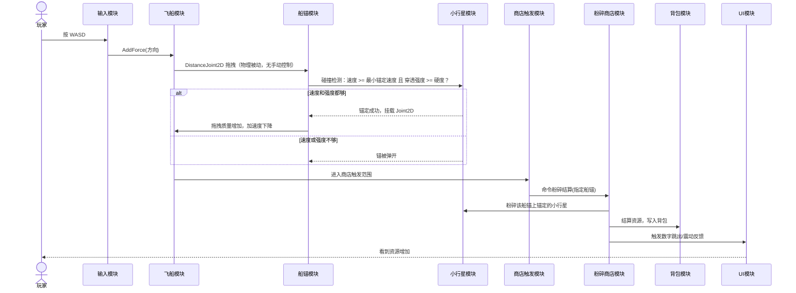
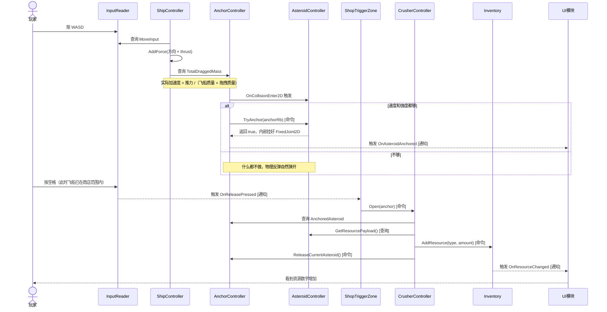
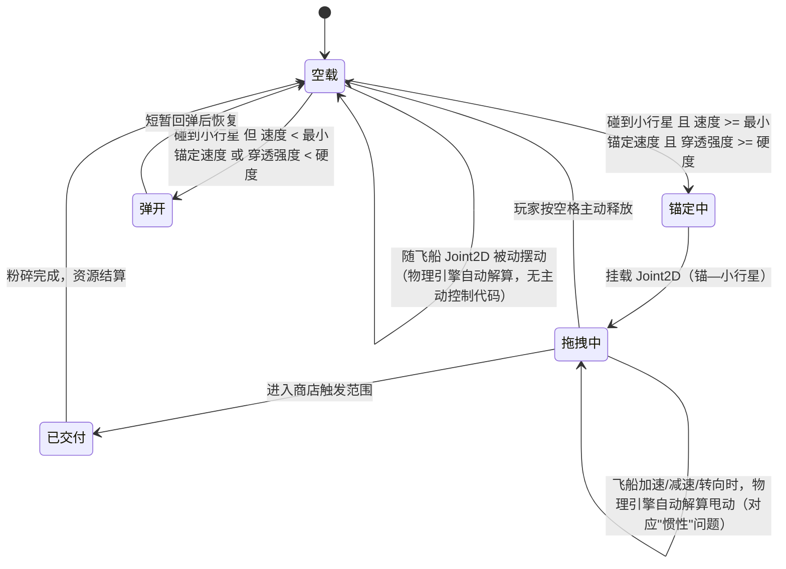
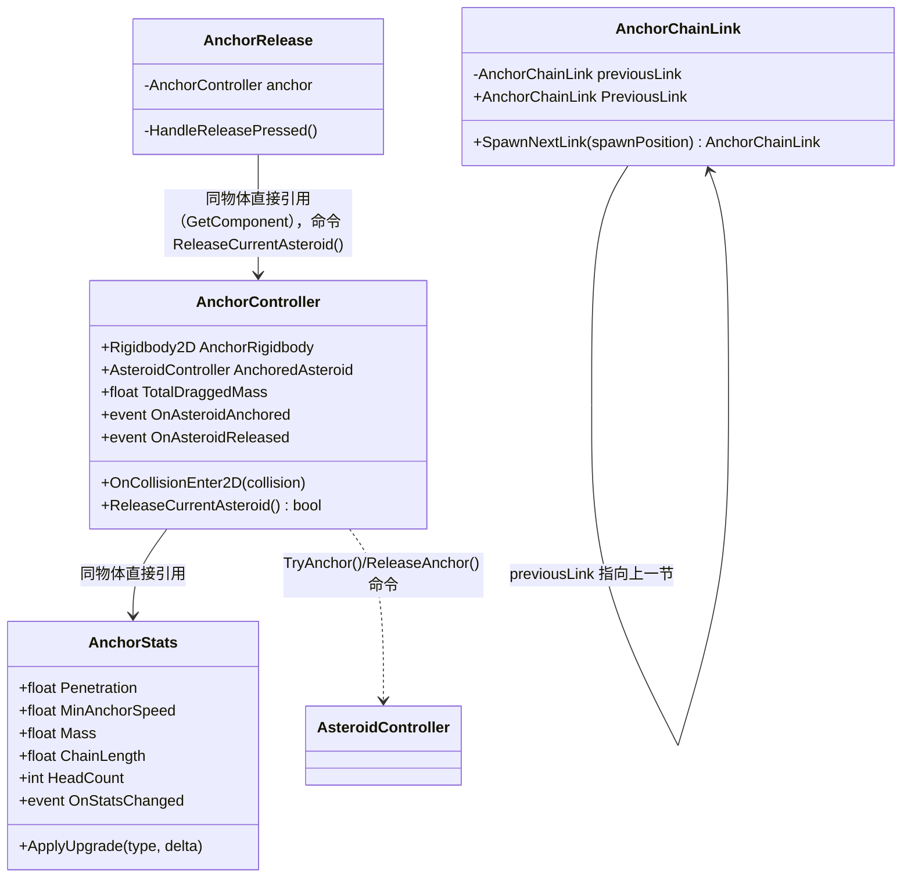

# 模块架构交接文档

> 阅读顺序建议：先看「一、总览」建立分层框架 → 再看「二、模块职责说明」逐个认识模块 → 「三、模块关系图」「四、模块通信设计」把模块之间的连线钉死 → 「五、核心循环时序图」看一次完整业务流程怎么串起来 → 「六、船锚模块关键设计」看全图最复杂的一块细节。

---

## 一、总览：分层架构与拆分原则

项目所有模块按**职责性质**分成四层，新增模块时只需要问一句话就能确定归属：

| 层 | 一句话标准 | 反向验证问法 |
|---|---|---|
| **基础设施层** | 逻辑唯一的服务/纯数据容器，只管存数据、发通知，不知道任何具体玩法规则 | 把"飞船""船锚""小行星"这些词从它的代码里划掉，它还能正常工作吗？能——就是基础设施层 |
| **核心玩法层** | 构成游戏世界的实体本身，有自己的物理行为/状态机，依赖基础设施层读输入、存数值 | 它是不是一个"东西"（有 Transform、有碰撞、有生命周期）？是——就是核心玩法层 |
| **编排层** | 不构成实体本身，只在合适的时机把多个核心玩法层实体/基础设施层数据串起来，实现一段业务流程 | 删掉它，游戏世界里的"东西"还都在，但它们互相之间的因果关系（进店、粉碎、结算）没了吗？是——就是编排层 |
| **表现层** | 纯下游消费者，只读/只订阅别的模块，没有任何模块反过来依赖它 | 有没有别的模块需要"引用它"或"等它的通知"才能工作？没有——就是表现层 |

---

## 二、模块职责说明（文字描述）

按上面的四层逐一介绍，每个模块标注对应脚本与优先级（P0 = MVP 必做，P1 = MVP 验收后补，P2 = jam 时间够了再做）。

### 2.1 基础设施层

**输入模块**（`InputReader.cs`，单例，P0）负责每帧读取 WASD 轴并暴露 `MoveInput` 属性，同时检测空格/M/J 三个按键的按下瞬间，各自声明一个 `event Action` 供其他模块订阅。它不知道"飞船""船锚"是什么，只做硬件输入到属性/事件的转换。空格键语义上对应"释放"，具体效果由订阅方按场上下文决定（见船锚模块与商店触发模块）；M 键对应"打开商店页面"。

**背包模块**（`Inventory.cs` 单例 + 共享枚举 `ResourceType.cs`，P0）只存资源字典和道具列表，暴露 `AddResource()`/`AddItem()`/`TryConsumeItem()` 等命令方法和 `GetResourceAmount()`/`GetItemCount()` 查询方法，内部改完数据后自己广播 `OnResourceChanged`/`OnItemChanged` 通知。它不知道"粉碎"这个业务概念。

**效果卡配置表模块**（`EffectCardData.cs` / `EffectCardDatabase.cs`，均为 `ScriptableObject`，P1）是纯策划配置数据：每张卡记录购买要花哪种资源、花多少（`costResourceType`/`costAmount`）以及生效的数值类型和增量（`statType`/`delta`）；`EffectCardDatabase` 收纳一批卡，暴露 `GetAllCards()` 查询接口。这一层完全没有行为逻辑。

**道具模块（数据部分）**（`ItemData.cs`，`ScriptableObject`，P2）只存 `displayName`/`description` 等展示信息，并暴露一个当前空实现的 `virtual Use()` 占位方法，供后续具体道具子类重写效果。

### 2.2 核心玩法层

**飞船模块**（`ShipController.cs` / `ShipStats.cs` / `ShipDamage.cs`，P0）是玩家操控的实体。`ShipController` 查询输入模块的 `MoveInput` 做 `AddForce`；`ShipStats` 存推力/血量/能源/质量并暴露 `ApplyDamage()`/`ApplyUpgrade()` 命令，内部改完值后广播 `OnStatsChanged`/`OnHealthChanged`；`ShipDamage` 负责碰撞算伤害，算完命令 `ShipStats.ApplyDamage()`。

**小行星模块**（`AsteroidController.cs`，P0，由"行星模块"重命名而来，终局撞行星玩法本轮不做）存硬度、质量、资源类型和数量，暴露一对对称的命令方法 `TryAnchor()`/`ReleaseAnchor()`（由船锚模块调用，锚定/解除锚定时挂载或销毁自己身上的 `FixedJoint2D`）以及查询方法 `GetResourcePayload()`（供粉碎商店结算时读取）。小行星自身体量小，暂不对外发通知。

**船锚模块**（`AnchorController.cs` / `AnchorStats.cs` / `AnchorRelease.cs` / `AnchorChainLink.cs`，单锚 P0、多锚 P2）是全图的枢纽实体，既挂载在飞船上（`DistanceJoint2D` 物理连接），又是锚定小行星的载体。`AnchorController` 做碰撞+速度+强度判定后挂 `FixedJoint2D`，暴露 `ReleaseCurrentAsteroid()` 命令和 `TotalDraggedMass` 查询，命中/释放时广播 `OnAsteroidAnchored`/`OnAsteroidReleased`；`AnchorRelease` 响应空格键，转发命令给 `AnchorController`——但只在飞船不在商店范围内时真正生效，范围内空格键会先被商店触发模块拦截去做"销毁结算"（见 4.5 与「六」）；`AnchorStats` 存穿透强度/最小锚定速度/质量/船锚长度等数值并暴露 `ApplyUpgrade()`；`AnchorChainLink` 是船锚对自身能力的扩展（多锚自关联，P2），运行时动态 `Instantiate` 下一节船锚。船锚的运动本身**不需要一行运动学代码**，全部由 `Rigidbody2D` + `DistanceJoint2D` 物理解算完成，详见「六、船锚模块关键设计」。

**粉碎商店模块**（`CrusherController.cs`，单例，P0）是全图连出去最多的节点：`Open()` 方法内部查询船锚锚定的小行星和其资源载荷，命令背包写入资源、命令船锚释放小行星，再广播 `OnCrushCompleted` 通知；粉碎结算不再自动应用任何效果卡。购买是玩家在商店里主动发起的**另一次独立操作**：`GetAvailableCards()` 查询效果卡配置表列出目录，`CanAfford()` 查询背包判断买不买得起，`TryBuyCard()` 在买得起时命令背包扣费、命令飞船/船锚的 `Stats` 应用升级——目前还没有实际的商店页面 UI 调用这三个方法，属于占位待补（P1）。

**道具模块（行为部分）**（`ItemUseHandler.cs`，P2）绑定单个道具槽位，订阅输入模块的用道具按键通知，命令背包 `TryConsumeItem()` 消耗成功后再命令该道具执行 `Use()` 效果。它自己不存状态，纯粹协调"按键 → 背包消耗道具"。
### 2.3 编排层

**小行星生成模块**（`AsteroidSpawner.cs`，P0，新增）负责按生成位置、密度、难度曲线 `Instantiate` 小行星实例；同时订阅粉碎商店的 `OnCrushCompleted` 通知，随粉碎次数增加动态调整难度曲线。它自己不是实体，只协调"何时、何处、按什么密度生成"。

**商店触发模块**（`ShopTriggerZone.cs`，P0，新增）用 `OnTriggerEnter2D`/`OnTriggerExit2D` 维护"飞船是否在商店范围内"的状态，同时订阅空格键和 M 键两个通知（内部都先判断是否在范围内）：空格键命中后命令粉碎商店 `CrusherController.Instance.Open(anchor)`（销毁结算，`anchor` 是 Inspector 里预先拖入的 `AnchorController` 引用）；M 键命中后打开商店页面（UI 面板待实现，目前只是占位日志）。用 `[DefaultExecutionOrder(-10)]` 保证它比 `AnchorRelease` 更早订阅同一个空格事件，确保范围内先粉碎结算、`AnchorRelease` 后续的释放调用变成安全的空操作。

### 2.4 表现层

**相机模块**（`CameraFollow.cs`，P0，新增）在 `LateUpdate` 里插值跟随飞船 `Transform`，是纯消费者，没有任何模块需要反过来依赖它，也不涉及事件或单例。虽然层级上属于表现层，但因为能让后续所有物理调试"看得见"，建议 MVP 第一批就做。

**链条视觉模块**（`RopeVisual.cs`，P0，新增）每帧读取两个 `Transform` 画 `LineRenderer` 连线，纯查询、无事件。多锚场景下每一段链条视觉的生命周期由创建它的 `AnchorChainLink` 一并管理（谁创建谁负责设置两个端点、谁销毁）。

**UI/HUD 模块**（`ResourceHUD.cs` / `HealthBar.cs` / `ScanInfoPanel.cs`，P1，新增）只订阅背包的资源变化、飞船血量变化、船锚锚定/释放通知来更新显示，不发布任何通知、不被任何模块直接引用——是整张通信图里唯一"只进不出"的下游终点。

---

## 三、模块关系图（UML 类图）

### 3.1 业务能力类图（模块粒度）

展示每个模块对外暴露的能力，以及模块之间的依赖/关联关系。箭头方向＝"谁调用/依赖谁"。

> `船锚模块`是全图的枢纽——同时被`飞船模块`（物理挂载）、`小行星模块`（锚定关系）、`链条视觉模块`（驱动渲染）依赖，改动它会波及三个下游模块，务必谨慎。

### 3.2 分层依赖图

同样一批模块，换成实际脚本名并按四层摆放，能一眼看出"越靠下越应该早做、越不该改接口"。

> 表现层只有指向下面三层的箭头，没有任何箭头指回表现层——这就是"UI/相机/链条视觉永远是下游终点"的图形化体现。`Crusher`（粉碎商店）和 `Anchor`（船锚）是连出去最多的两个节点，改动这两个模块要格外小心。

---

## 四、模块通信设计

### 4.1 通信三原则：命令 / 查询 / 通知

模块之间的调用统一按三种性质区分，混着用会乱：

| 交互类型 | 定义 | 落地方式 | 举例 |
|---|---|---|---|
| **命令**（改数据） | 调用方明确要"让对方做一件事/改一个状态" | 直接引用对方，调用对方暴露的公开方法 | `Inventory.Instance.AddResource(type, amount)` |
| **查询**（读数据） | 调用方只是想知道对方当前的值，不改变对方状态 | 直接引用对方，读属性或调用只读方法 | `ShipController` 读 `anchor.TotalDraggedMass` |
| **通知**（广播变化） | 数据被"命令"改变之后，让所有关心的人知道，发布方不关心谁在听 | 数据拥有者自己声明 `event`，在命令方法内部改完值后触发 | `Inventory` 内部改完字典后自己 `OnResourceChanged?.Invoke(...)` |

**核心规则一句话：改谁的数据就调用谁暴露的方法（命令）；数据拥有者自己负责在方法内部改完之后广播通知；纯读取用查询，不要为了"解耦"硬包一层事件。**

事件本身走**方案 A：分散事件**——声明在各自的数据拥有者模块上，不设全局 `GameEvents` 类。

### 4.2 复用结构模式：`XxxController` + `XxxStats`

飞船和船锚都有"一堆可升级的数值" + "一套依赖这些数值的行为逻辑"，统一拆成两个脚本，以后新模块符合这个特征就照搬：

- **`XxxStats`**：只存数值，暴露 `ApplyUpgrade(...)`/`ApplyDamage(...)` 这类命令方法，内部改完值后触发自己的 `OnStatsChanged`/`OnHealthChanged` 通知。
- **`XxxController`**：只写行为逻辑（读输入、碰撞判定、`AddForce`、挂 `Joint2D`），需要数值时直接引用同物体上的 `XxxStats`（`GetComponent`）。

好处：升级系统只碰 `Stats` 脚本，不牵扯物理/碰撞逻辑；`Controller` 也不会因为策划改了一个数值定义就要重新测试物理行为。

### 4.3 单例范围

按"是否逻辑唯一"决定要不要做单例：

| 单例（逻辑上唯一） | 非单例（可能多份实例，走直接引用） |
|---|---|
| `InputReader` | `ShipController` / `ShipStats` |
| `Inventory` | `AnchorController` / `AnchorStats` |
| `CrusherController` | `AsteroidController`（场上很多颗） |
| | `RopeVisual`（每段链条一份） |
| | `ShopTriggerZone` / `AnchorChainLink` / `ItemUseHandler`：只服务于自己所在物体，不需要跨物体查找 |
| | `EffectCardDatabase` / `ItemData`：SO 资产本身唯一，直接引用资产，不用额外套单例壳 |

### 4.4 总体通信关系图（区分"直接引用"和"事件订阅"）

实线 `-->` ＝直接引用（命令或查询，箭头指向被调用方）；虚线 `-.->` ＝事件订阅（通知，箭头指向订阅方）。

> UI 模块只有虚线指向它，没有任何实线指向它或从它出发——"UI 永远是下游终点"在图上的直接体现。

### 4.5 脚本职责与通信方式速查表

| 模块 | 脚本 | 核心职责 | 通信方式 |
|---|---|---|---|
| 输入模块 | `InputReader.cs`（单例） | 每帧读 WASD 轴，暴露 `MoveInput` 属性；检测空格/M/J 按下瞬间，各自声明一个 `event Action` | `MoveInput` 被**查询**（`ShipController` 每 `FixedUpdate` 读）；空格键被**订阅**两次（`AnchorRelease`/`ShopTriggerZone`，后者靠 `DefaultExecutionOrder` 抢先处理）；M/J 各自被**订阅**（`ShopTriggerZone`/`ItemUseHandler`） |
| 相机模块 | `CameraFollow.cs` | `LateUpdate` 插值跟随目标 | 直接引用飞船 `Transform`（Inspector 拖拽），无事件、无单例 |
| 飞船模块 | `ShipController.cs` `ShipStats.cs` `ShipDamage.cs` | 读输入 `AddForce`；存推力/血量/能源/质量，暴露 `ApplyDamage()`/`ApplyUpgrade()`；碰撞算伤害 | `ShipController` **查询** `InputReader.MoveInput` 和 `AnchorController.TotalDraggedMass`，并**订阅** `ShipStats.OnStatsChanged`；`ShipDamage` **命令** `ShipStats.ApplyDamage()`；`ShipStats` **通知** `OnHealthChanged`/`OnStatsChanged` |
| 船锚模块 | `AnchorController.cs` `AnchorStats.cs` `AnchorRelease.cs` `AnchorChainLink.cs`（P2） | 碰撞+速度+强度判定→挂 `FixedJoint2D`；存穿透强度/船锚长度等数值；玩家主动释放；多锚自关联 | 详见「六、船锚模块关键设计」 |
| 链条视觉模块 | `RopeVisual.cs` | 每帧读两个 `Transform` 画线 | 纯**查询**，无事件；多锚时的生命周期由 `AnchorChainLink` 创建/销毁配对 |
| 小行星模块 | `AsteroidController.cs` | 存硬度/质量/资源类型数量；暴露 `TryAnchor()`/`ReleaseAnchor()`（命令，对称）、`GetResourcePayload()`（查询） | 被 `AnchorController` **命令**；被 `CrusherController` **查询**；自己不发通知 |
| 小行星生成模块 | `AsteroidSpawner.cs` | 按密度/难度曲线 `Instantiate` 小行星 | 创建新实例；**订阅** `CrusherController.OnCrushCompleted` 累计难度曲线 |
| 商店触发模块 | `ShopTriggerZone.cs` | `OnTriggerEnter/Exit2D` 维护"飞船是否在范围内"；范围内响应空格键（销毁结算）和 M 键（打开商店页面，占位待实现） | **订阅** `InputReader.OnReleasePressed`（比 `AnchorRelease` 更早，靠 `DefaultExecutionOrder`）**命令** `CrusherController.Instance.Open(anchor)`；**订阅** `InputReader.OnOpenShopPressed` |
| 粉碎商店模块 | `CrusherController.cs`（单例） | `Open()` 粉碎指定船锚锚定的小行星、结算资源；另外暴露 `GetAvailableCards()`/`CanAfford()`/`TryBuyCard()` | `Open()` 内部**查询** `AnchorController.AnchoredAsteroid`/`AsteroidController.GetResourcePayload()`；**命令** `Inventory.AddResource()`/`AnchorController.ReleaseCurrentAsteroid()`；**通知** `OnCrushCompleted`。购买另计：**查询** `EffectCardDatabase.GetAllCards()`/`Inventory.GetResourceAmount()`；买得起时**命令** `Inventory.AddResource()`（扣费）/`ShipStats.ApplyUpgrade()`/`AnchorStats.ApplyUpgrade()` |
| 背包模块 | `Inventory.cs`（单例） `ResourceType.cs`（共享枚举） | 存资源/道具，暴露 `AddResource()`/`AddItem()`/`TryConsumeItem()`；`GetResourceAmount()`/`GetItemCount()` | 接受**命令**；支持**查询**；自己**通知** `OnResourceChanged`/`OnItemChanged` |
| UI 模块 | `ResourceHUD.cs` `HealthBar.cs` `ScanInfoPanel.cs` | 纯展示 | 只**订阅**，不发布、不被任何模块直接引用 |
| 效果卡配置表模块 | `EffectCardData.cs`（SO） `EffectCardDatabase.cs`（SO） | 存购买花费和生效数值；暴露 `GetAllCards()` | 被 `CrusherController` **查询**；静态数据不涉及事件 |
| 道具模块 | `ItemData.cs`（SO） `ItemUseHandler.cs` | 展示信息 + 占位 `Use()`；响应"使用道具"输入 | **订阅** `InputReader.OnUseItemPressed`；**命令** `Inventory.TryConsumeItem()` 成功后**命令** `boundItem.Use()` |

---

## 五、核心循环时序图：一次完整的"捕获 → 拖回 → 粉碎"循环

### 5.1 概念版（模块粒度）

对应 MVP 验收标准的完整流程，模块之间"谁在什么时机调用谁"一目了然。

### 5.2 实现版（脚本/方法粒度，标注命令/查询/通知）

同一条流程换成真实脚本名和方法名，方括号标了每一步的通信性质，写代码时可以直接对照确定"这一行该是直接调用还是订阅事件"。

---

## 六、船锚模块关键设计

船锚是全图的枢纽模块，也是历史上最容易被误实现的一个（曾经把"移动功能"写成主动控制代码），这里单独展开。

### 6.1 状态机：回答"船锚的移动功能到底怎么实现"

把"移动功能"落成一个清晰的状态机，明确哪些状态是**玩家主动触发**，哪些是**物理引擎被动解算**（不需要、也不应该手写代码控制位置）。

> **关键点**：图里唯一需要"主动控制代码"的转移只有两条——碰撞检测触发锚定（走 Unity 的 `OnCollisionEnter2D`），以及空格键触发释放（走输入模块）。其余所有运动相关的转移都是物理引擎自动解算，也就是说船锚模块本身**不需要一行运动学代码**，只需要在 Inspector 里配好 `Rigidbody2D` + `DistanceJoint2D(maxDistanceOnly=true)` 的参数。

### 6.2 内部结构（含多锚自关联）

**多锚（P2）新增一节走运行时动态 `Instantiate`**：`AnchorChainLink.SpawnNextLink()` 在链条末端生成下一节船锚，用 `DistanceJoint2D` 连回上一节（不是连飞船），并同步创建配套的 `RopeVisual`，"谁创建谁负责设两个端点"。这是核心玩法层直接引用表现层的一个窄口径例外，不是可以绕开的实现细节。挂多锚组件的预制体里，`AnchorController.shipRigidbody` 应留空——只有链条头一节（直接连船的那一节）才需要填。

---

## 七、模块速查表（附录）

| 模块 | 层 | 脚本 | 优先级 |
|---|---|---|---|
| 输入模块 | 基础设施层 | `InputReader.cs`（单例） | P0 |
| 背包模块 | 基础设施层 | `Inventory.cs`（单例）/`ResourceType.cs` | P0 |
| 效果卡配置表模块 | 基础设施层 | `EffectCardData.cs`/`EffectCardDatabase.cs`（SO） | P1 |
| 道具模块（数据） | 基础设施层 | `ItemData.cs`（SO） | P2 |
| 飞船模块 | 核心玩法层 | `ShipController.cs`/`ShipStats.cs`/`ShipDamage.cs` | P0 |
| 小行星模块 | 核心玩法层 | `AsteroidController.cs` | P0 |
| 船锚模块 | 核心玩法层 | `AnchorController.cs`/`AnchorStats.cs`/`AnchorRelease.cs`/`AnchorChainLink.cs` | P0（单锚）/P2（多锚） |
| 粉碎商店模块 | 核心玩法层 | `CrusherController.cs`（单例） | P0 |
| 道具模块（行为） | 核心玩法层 | `ItemUseHandler.cs` | P2 |
| 小行星生成模块 | 编排层 | `AsteroidSpawner.cs` | P0 |
| 商店触发模块 | 编排层 | `ShopTriggerZone.cs` | P0 |
| 相机模块 | 表现层 | `CameraFollow.cs` | P0 |
| 链条视觉模块 | 表现层 | `RopeVisual.cs` | P0 |
| UI/HUD 模块 | 表现层 | `ResourceHUD.cs`/`HealthBar.cs`/`ScanInfoPanel.cs` | P1 |

---

## 七、一句话总结

**模块按四层拆分（基础设施 / 核心玩法 / 编排 / 表现），层与层之间只允许上层依赖下层；模块之间改数据用命令、读数据用查询、数据变化后数据拥有者自己广播通知（分散事件，不设全局事件类）；单例只留给场景里逻辑唯一的模块；船锚的运动完全由物理引擎被动解算，主动控制代码只出现在碰撞锚定和按键释放两处。** 拿着这份文档，配合「三、模块关系图」「五、核心循环时序图」，应该能在不读源码的情况下先把整个架构在脑子里搭起来，再对照「二、模块职责说明」和 4.5脚本职责与通信方式 逐个模块去看实际代码。
